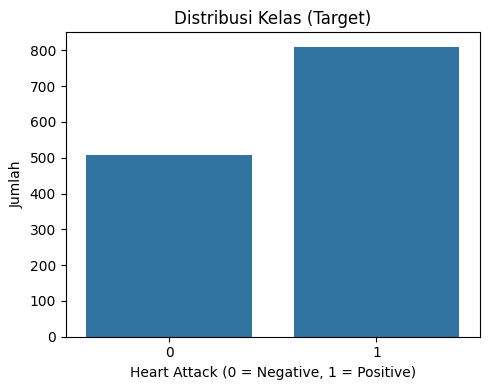
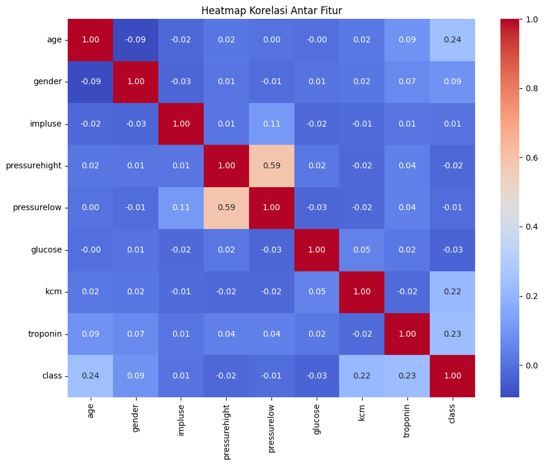
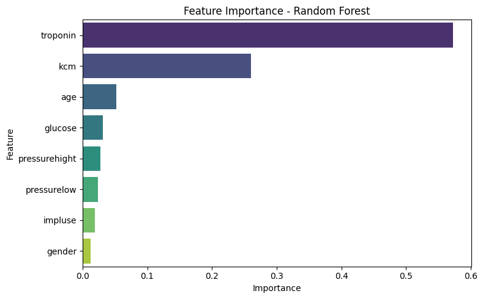
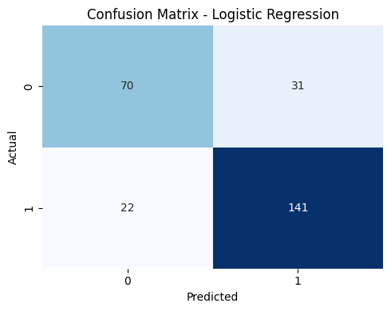
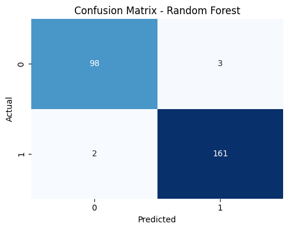
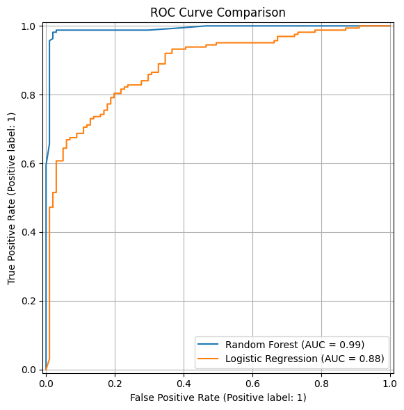

# 🧠 Heart Attack Prediction Project - Arief Setiawan

## 📌 Domain Proyek

Penyakit jantung merupakan penyebab utama kematian secara global. Organisasi Kesehatan Dunia (WHO) melaporkan bahwa 17,9 juta orang meninggal setiap tahun akibat penyakit kardiovaskular, termasuk serangan jantung. Kondisi ini menuntut deteksi dini agar penanganan dapat dilakukan secara cepat dan tepat.

Masalah ini harus diselesaikan karena serangan jantung sering kali terjadi secara mendadak. Dengan bantuan teknologi seperti machine learning, kita dapat membangun sistem prediksi yang membantu tenaga medis dalam membuat keputusan berbasis data.

**Referensi:**
World Health Organization. (2023). Cardiovascular diseases (CVDs). [https://www.who.int/news-room/fact-sheets/detail/cardiovascular-diseases-(cvds)](https://www.who.int/news-room/fact-sheets/detail/cardiovascular-diseases-(cvds))

## 🎯 Business Understanding

### Problem Statements
- Bagaimana memprediksi risiko serangan jantung berdasarkan data medis pasien?
- Fitur apa yang paling berkontribusi terhadap prediksi serangan jantung?

### Goals
- Mengembangkan model prediksi klasifikasi serangan jantung.
- Mengidentifikasi fitur paling penting untuk prediksi serangan jantung.

### Solution Statements
- Menggunakan dua algoritma: **Random Forest Classifier** dan **Logistic Regression** untuk membandingkan performa.
- Menggunakan metrik evaluasi seperti **Accuracy**, **F1-score**, dan **ROC AUC** untuk mengukur performa model.
- Memilih model terbaik berdasarkan hasil evaluasi.

## 📊 Data Understanding

Dataset diambil dari Kaggle:
**Link:** [https://www.kaggle.com/datasets/bharath011/heart-disease-classification-dataset](https://www.kaggle.com/datasets/bharath011/heart-disease-classification-dataset)

Dataset berisi 1319 entri dan 9 kolom:
- `age`: Usia pasien
- `gender`: Jenis kelamin (0 = perempuan, 1 = laki-laki)
- `impluse`: Detak jantung
- `pressurehight`: Tekanan darah atas (sistolik)
- `pressurelow`: Tekanan darah bawah (diastolik)
- `glucose`: Kadar glukosa darah
- `kcm`: Kadar kalium
- `troponin`: Kadar troponin (indikator kerusakan otot jantung)
- `class`: Target klasifikasi (positive = serangan jantung, negative = tidak)

### Visualisasi dan Analisis:

- Distribusi target tidak seimbang (61% positif).
- Korelasi tertinggi dengan kelas target: `troponin` dan `kcm`.

## 🧹 Data Preparation

**Langkah:**
1. Encoding target `class` menjadi numerik (0/1).
2. Normalisasi fitur numerik dengan `StandardScaler`.
3. Split data ke training/testing (80:20).

**Alasan:**
- Encoding diperlukan untuk kompatibilitas model ML.
- Normalisasi membantu proses pelatihan menjadi lebih stabil dan efisien.

## 🤖 Modeling

**Model 1: Random Forest**
- Algoritma ansambel berbasis pohon keputusan.
- Keunggulan: akurat, mampu menangani data non-linear.
- Kekurangan: lebih kompleks dan memakan waktu.

**Model 2: Logistic Regression**
- Model linier sederhana.
- Keunggulan: mudah diinterpretasi, cepat.
- Kekurangan: kurang fleksibel untuk data kompleks.

  

**Feature Importance (Random Forest):**
- `troponin` (57%) dan `kcm` (26%) adalah fitur paling berpengaruh.

**Pemilihan Model Terbaik:**
- Random Forest dipilih sebagai model terbaik karena akurasi dan ROC AUC yang lebih tinggi.

## 📈 Evaluation

**Metrik:**
- **Accuracy**: jumlah prediksi benar dibagi total data.
- **F1-Score**: rata-rata harmonis precision dan recall. Berguna untuk data tidak seimbang.
- **ROC AUC**: luas area di bawah kurva ROC.

### Hasil Evaluasi:

| Model               | Accuracy | F1-Score (Positif) | ROC AUC |
|--------------------|----------|--------------------|---------|
| Random Forest       | 98.1%    | 0.985              | 0.991   |
| Logistic Regression | 79.9%    | 0.842              | 0.884   |

Random Forest menghasilkan performa yang unggul dalam semua metrik, menjadikannya pilihan utama untuk sistem prediksi ini.

---

**Catatan:** Laporan ini dibuat berdasarkan dataset publik dan dapat dikembangkan lebih lanjut menggunakan data real dari institusi kesehatan jika tersedia.

